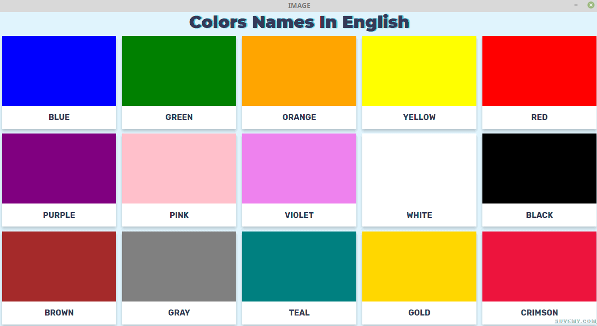
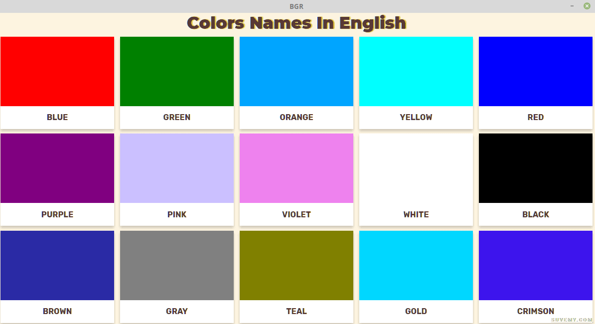
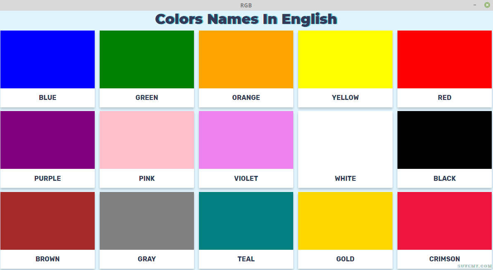

#### A simple tutorial to see how to change RGB to BGR and what effects occur on the image while doing so

##### Original Image

##### Using cvtColor to get BGR config 

##### Converting back to RGB

