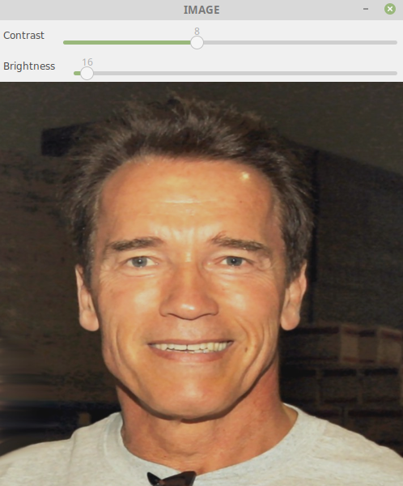

Adding trackbar is a must in opencv, because putting random numbers for threshhold and changing parameters is not a viable option a better visual solution is implementing a trackbar to change parameters.
the result is something like this

